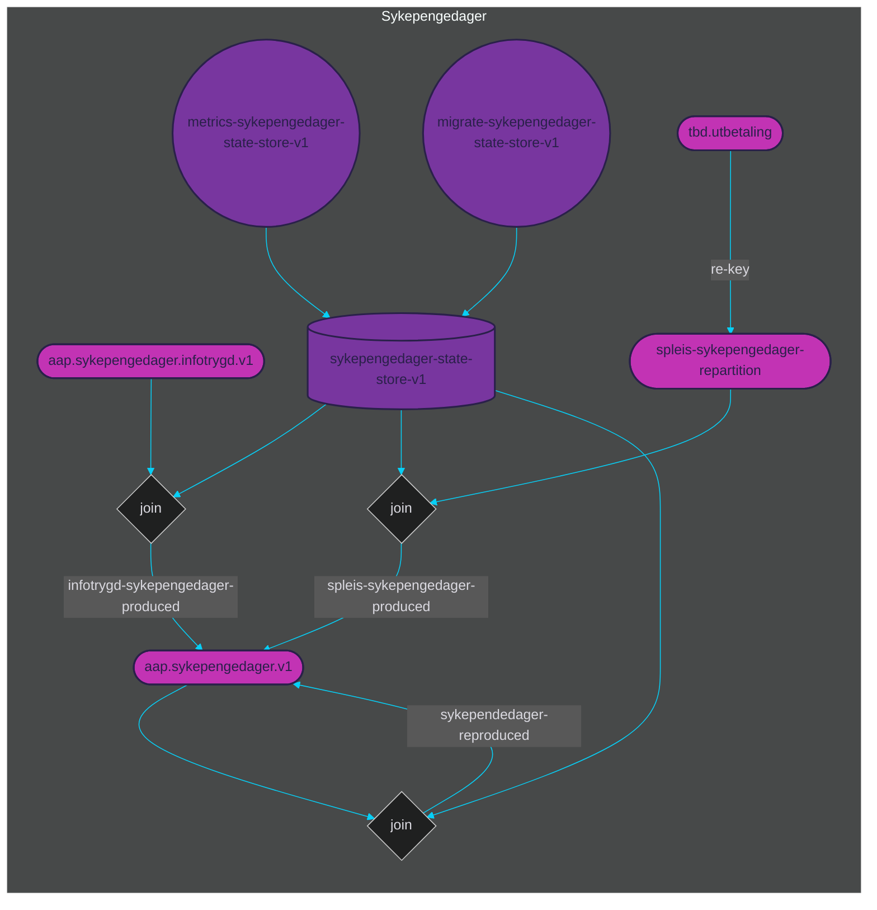

```mermaid

%%{init: {'theme': 'dark', 'themeVariables': { 'primaryColor': '#07cff6', 'textColor': '#dad9e0', 'lineColor': '#07cff6'}}}%%

graph LR

subgraph Sykepengedager
    %% TOPICS
    aap.sykepengedager.v1([aap.sykepengedager.v1])
	aap.sykepengedager.infotrygd.v1([aap.sykepengedager.infotrygd.v1])
	spleis-sykepengedager-repartition([spleis-sykepengedager-repartition])
	tbd.utbetaling([tbd.utbetaling])
    
    %% JOINS
    join-0{join}
	join-1{join}
	join-2{join}
    
    %% STATE STORES
    sykepengedager-state-store-v1[(sykepengedager-state-store-v1)]
    
    %% PROCESSOR API JOBS
    metrics-sykepengedager-state-store-v1((metrics-sykepengedager-state-store-v1))
	migrate-sykepengedager-state-store-v1((migrate-sykepengedager-state-store-v1))
    
    %% JOIN STREAMS
    aap.sykepengedager.infotrygd.v1 --> join-0
	sykepengedager-state-store-v1 --> join-0
	join-0 --> |infotrygd-sykepengedager-produced| aap.sykepengedager.v1
	spleis-sykepengedager-repartition --> join-1
	sykepengedager-state-store-v1 --> join-1
	join-1 --> |spleis-sykepengedager-produced| aap.sykepengedager.v1
	aap.sykepengedager.v1 --> join-2
	sykepengedager-state-store-v1 --> join-2
	join-2 --> |sykependedager-reproduced| aap.sykepengedager.v1
    
    %% JOB STREAMS
    metrics-sykepengedager-state-store-v1 --> sykepengedager-state-store-v1
	migrate-sykepengedager-state-store-v1 --> sykepengedager-state-store-v1
    
    %% REPARTITION STREAMS
    tbd.utbetaling --> |re-key| spleis-sykepengedager-repartition
end

%% COLORS
%% light    #dad9e0
%% purple   #78369f
%% pink     #c233b4
%% dark     #2a204a
%% blue     #07cff6

%% STYLES
style aap.sykepengedager.v1 fill:#c233b4, stroke:#2a204a, stroke-width:2px, color:#2a204a
style aap.sykepengedager.infotrygd.v1 fill:#c233b4, stroke:#2a204a, stroke-width:2px, color:#2a204a
style spleis-sykepengedager-repartition fill:#c233b4, stroke:#2a204a, stroke-width:2px, color:#2a204a
style tbd.utbetaling fill:#c233b4, stroke:#2a204a, stroke-width:2px, color:#2a204a
style sykepengedager-state-store-v1 fill:#78369f, stroke:#2a204a, stroke-width:2px, color:#2a204a
style metrics-sykepengedager-state-store-v1 fill:#78369f, stroke:#2a204a, stroke-width:2px, color:#2a204a
style migrate-sykepengedager-state-store-v1 fill:#78369f, stroke:#2a204a, stroke-width:2px, color:#2a204a

```
